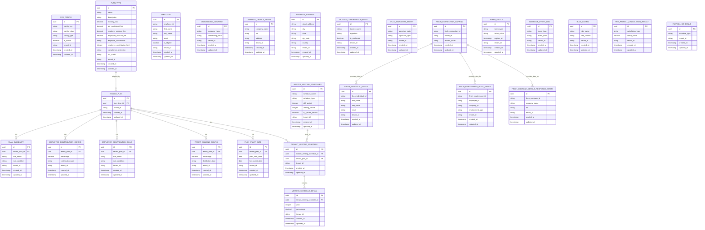

# Database ERD (PostgreSQL Schema)

Generated from actual database schema using Flyway migrations.

```mermaid
erDiagram
    %% System/Master Tables
    SYS_CONFIG {
        uuid id PK
        string config_key
        string config_value
        string config_type
        boolean is_active
        string tenant_id
        timestamp created_at
        timestamp updated_at
    }
    
    MASTER_VESTING_SCHEDULES {
        uuid id PK
        string schedule_name
        string schedule_type
        integer cliff_period
        integer vesting_period
        boolean is_system_default
        string tenant_id
        timestamp created_at
        timestamp updated_at
    }
    
    %% Core Business Tables
    PLAN_TYPE {
        uuid id PK
        string name
        string description
        decimal monthly_cost
        decimal per_participant_fee
        decimal employer_account_fee
        decimal employee_account_fee
        string employer_contribution
        integer employee_contribution_limit
        string compliance_protection
        string tax_credit
        string tenant_id
        timestamp created_at
        timestamp updated_at
    }
    
    TENANT_PLAN {
        uuid id PK
        uuid plan_type_id FK
        string tenant_id
        timestamp created_at
        timestamp updated_at
    }
    
    EMPLOYEE {
        uuid id PK
        string employee_id
        string first_name
        string last_name
        string email
        boolean is_eligible
        string tenant_id
        timestamp created_at
        timestamp updated_at
    }
    
    ONBOARDING_COMPANY {
        uuid id PK
        string company_name
        string onboarding_state
        string tenant_id
        timestamp created_at
        timestamp updated_at
    }
    
    COMPANY_DETAILS_ENTITY {
        uuid id PK
        string company_name
        string ein
        string address
        string tenant_id
        timestamp created_at
        timestamp updated_at
    }
    
    BUSINESS_ADDRESS {
        uuid id PK
        string street_address
        string city
        string state
        string zip_code
        string country
        string tenant_id
        timestamp created_at
        timestamp updated_at
    }
    
    %% Configuration Tables
    PLAN_ELIGIBILITY {
        uuid id PK
        uuid tenant_plan_id FK
        string rule_name
        string rule_condition
        string tenant_id
        timestamp created_at
        timestamp updated_at
    }
    
    EMPLOYEE_CONTRIBUTION_CONFIG {
        uuid id PK
        uuid tenant_plan_id FK
        decimal percentage
        string contribution_type
        string tenant_id
        timestamp created_at
        timestamp updated_at
    }
    
    EMPLOYER_CONTRIBUTION_RULE {
        uuid id PK
        uuid tenant_plan_id FK
        string rule_name
        string rule_condition
        string tenant_id
        timestamp created_at
        timestamp updated_at
    }
    
    PROFIT_SHARING_CONFIG {
        uuid id PK
        uuid tenant_plan_id FK
        decimal percentage
        string distribution_type
        string tenant_id
        timestamp created_at
        timestamp updated_at
    }
    
    PLAN_START_DATE {
        uuid id PK
        uuid tenant_plan_id FK
        date plan_start_date
        date key_event_date
        string tenant_id
        timestamp created_at
        timestamp updated_at
    }
    
    %% Vesting Schedule Tables
    TENANT_VESTING_SCHEDULE {
        uuid id PK
        uuid master_vesting_schedule_id FK
        uuid tenant_plan_id FK
        string tenant_id
        timestamp created_at
        timestamp updated_at
    }
    
    VESTING_SCHEDULE_DETAIL {
        uuid id PK
        uuid tenant_vesting_schedule_id FK
        integer year
        decimal percentage
        string tenant_id
        timestamp created_at
        timestamp updated_at
    }
    
    %% Signature Tables
    TRUSTEE_CONFIRMATION_ENTITY {
        uuid id PK
        string trustee_name
        string signature
        boolean is_confirmed
        string tenant_id
        timestamp created_at
        timestamp updated_at
    }
    
    PLAN_SIGNATURE_ENTITY {
        uuid id PK
        string signature_data
        string signature_type
        string tenant_id
        timestamp created_at
        timestamp updated_at
    }
    
    %% Finch Integration Tables
    FINCH_INDIVIDUAL_ENTITY {
        uuid id PK
        string finch_individual_id
        string first_name
        string last_name
        string email
        string tenant_id
        timestamp created_at
        timestamp updated_at
    }
    
    FINCH_EMPLOYMENT_BODY_ENTITY {
        uuid id PK
        string finch_employment_id
        string employee_id
        string company_id
        string employment_type
        string tenant_id
        timestamp created_at
        timestamp updated_at
    }
    
    FINCH_COMPANY_DETAILS_RESPONSE_ENTITY {
        uuid id PK
        string finch_company_id
        string company_name
        string ein
        string tenant_id
        timestamp created_at
        timestamp updated_at
    }
    
    FINCH_CONNECTION_MAPPING {
        uuid id PK
        string finch_connection_id
        string tenant_id
        string access_token
        timestamp created_at
        timestamp updated_at
    }
    
    %% Other Tables
    TOKEN_ENTITY {
        uuid id PK
        string token_type
        string token_value
        timestamp expires_at
        string tenant_id
        timestamp created_at
        timestamp updated_at
    }
    
    WEBHOOK_EVENT_LOG {
        uuid id PK
        string event_type
        string event_data
        string tenant_id
        timestamp created_at
        timestamp updated_at
    }
    
    RULE_CONFIG {
        uuid id PK
        string rule_name
        string rule_content
        string tenant_id
        timestamp created_at
        timestamp updated_at
    }
    
    PRE_PAYROLL_CALCULATION_RESULT {
        uuid id PK
        string calculation_type
        decimal result_value
        string tenant_id
        timestamp created_at
        timestamp updated_at
    }
    
    PAYROLL_SCHEDULE {
        uuid id PK
        string schedule_type
        string tenant_id
        timestamp created_at
        timestamp updated_at
    }
    
    %% Relationships
    %% System/Master relationships
    MASTER_VESTING_SCHEDULES ||--o{ TENANT_VESTING_SCHEDULE : "used_by"
    
    %% Core business relationships
    PLAN_TYPE ||--o{ TENANT_PLAN : "adopted_by"
    TENANT_PLAN ||--o{ PLAN_ELIGIBILITY : "has"
    TENANT_PLAN ||--o{ EMPLOYEE_CONTRIBUTION_CONFIG : "has"
    TENANT_PLAN ||--o{ EMPLOYER_CONTRIBUTION_RULE : "has"
    TENANT_PLAN ||--o{ PROFIT_SHARING_CONFIG : "has"
    TENANT_PLAN ||--o{ PLAN_START_DATE : "has"
    TENANT_PLAN ||--o{ TENANT_VESTING_SCHEDULE : "has"
    
    %% Vesting relationships
    TENANT_VESTING_SCHEDULE ||--o{ VESTING_SCHEDULE_DETAIL : "contains"
    
    %% Finch relationships
    FINCH_CONNECTION_MAPPING ||--o{ FINCH_INDIVIDUAL_ENTITY : "provides_data_for"
    FINCH_CONNECTION_MAPPING ||--o{ FINCH_EMPLOYMENT_BODY_ENTITY : "provides_data_for"
    FINCH_CONNECTION_MAPPING ||--o{ FINCH_COMPANY_DETAILS_RESPONSE_ENTITY : "provides_data_for"
```

Generated on: $(date)
