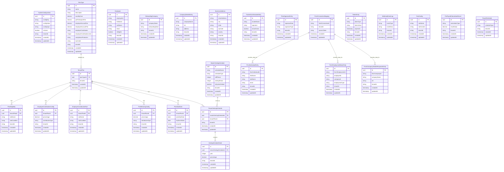

# Entities ERD (JPA Code)

Generated from JPA entity annotations in code.

```mermaid
erDiagram
    %% System/Master Entities
    SystemConfiguration {
        uuid id PK
        string configKey
        string configValue
        string configType
        boolean isActive
        string tenantId
        timestamp createdAt
        timestamp updatedAt
    }
    
    MasterVestingSchedule {
        uuid id PK
        string scheduleName
        string scheduleType
        integer cliffPeriod
        integer vestingPeriod
        boolean isSystemDefault
        string tenantId
        timestamp createdAt
        timestamp updatedAt
    }
    
    %% Core Business Entities
    PlanType {
        uuid id PK
        string name
        string description
        decimal monthlyCost
        decimal perParticipantFee
        decimal employerAccountFee
        decimal employeeAccountFee
        string employerContribution
        integer employeeContributionLimit
        string complianceProtection
        string taxCredit
        string tenantId
        timestamp createdAt
        timestamp updatedAt
    }
    
    TenantPlan {
        uuid id PK
        uuid planTypeId FK
        string tenantId
        timestamp createdAt
        timestamp updatedAt
    }
    
    Employee {
        uuid id PK
        string employeeId
        string firstName
        string lastName
        string email
        boolean isEligible
        string tenantId
        timestamp createdAt
        timestamp updatedAt
    }
    
    OnboardingCompany {
        uuid id PK
        string companyName
        string onboardingState
        string tenantId
        timestamp createdAt
        timestamp updatedAt
    }
    
    CompanyDetailsEntity {
        uuid id PK
        string companyName
        string ein
        string address
        string tenantId
        timestamp createdAt
        timestamp updatedAt
    }
    
    BusinessAddress {
        uuid id PK
        string streetAddress
        string city
        string state
        string zipCode
        string country
        string tenantId
        timestamp createdAt
        timestamp updatedAt
    }
    
    %% Configuration Entities
    PlanEligibility {
        uuid id PK
        uuid tenantPlanId FK
        string ruleName
        string ruleCondition
        string tenantId
        timestamp createdAt
        timestamp updatedAt
    }
    
    EmployeeContributionConfig {
        uuid id PK
        uuid tenantPlanId FK
        decimal percentage
        string contributionType
        string tenantId
        timestamp createdAt
        timestamp updatedAt
    }
    
    EmployerContributionRule {
        uuid id PK
        uuid tenantPlanId FK
        string ruleName
        string ruleCondition
        string tenantId
        timestamp createdAt
        timestamp updatedAt
    }
    
    ProfitSharingConfig {
        uuid id PK
        uuid tenantPlanId FK
        decimal percentage
        string distributionType
        string tenantId
        timestamp createdAt
        timestamp updatedAt
    }
    
    PlanStartDate {
        uuid id PK
        uuid tenantPlanId FK
        date planStartDate
        date keyEventDate
        string tenantId
        timestamp createdAt
        timestamp updatedAt
    }
    
    %% Vesting Schedule Entities
    TenantVestingSchedule {
        uuid id PK
        uuid masterVestingScheduleId FK
        uuid tenantPlanId FK
        string tenantId
        timestamp createdAt
        timestamp updatedAt
    }
    
    VestingScheduleDetail {
        uuid id PK
        uuid tenantVestingScheduleId FK
        integer year
        decimal percentage
        string tenantId
        timestamp createdAt
        timestamp updatedAt
    }
    
    %% Signature Entities
    TrusteeConfirmationEntity {
        uuid id PK
        string trusteeName
        string signature
        boolean isConfirmed
        string tenantId
        timestamp createdAt
        timestamp updatedAt
    }
    
    PlanSignatureEntity {
        uuid id PK
        string signatureData
        string signatureType
        string tenantId
        timestamp createdAt
        timestamp updatedAt
    }
    
    %% Finch Integration Entities
    FinchIndividualEntity {
        uuid id PK
        string finchIndividualId
        string firstName
        string lastName
        string email
        string tenantId
        timestamp createdAt
        timestamp updatedAt
    }
    
    FinchEmploymentBodyEntity {
        uuid id PK
        string finchEmploymentId
        string employeeId
        string companyId
        string employmentType
        string tenantId
        timestamp createdAt
        timestamp updatedAt
    }
    
    FinchCompanyDetailsResponseEntity {
        uuid id PK
        string finchCompanyId
        string companyName
        string ein
        string tenantId
        timestamp createdAt
        timestamp updatedAt
    }
    
    FinchConnectionMapping {
        uuid id PK
        string finchConnectionId
        string tenantId
        string accessToken
        timestamp createdAt
        timestamp updatedAt
    }
    
    %% Other Entities
    TokenEntity {
        uuid id PK
        string tokenType
        string tokenValue
        timestamp expiresAt
        string tenantId
        timestamp createdAt
        timestamp updatedAt
    }
    
    WebhookEventLog {
        uuid id PK
        string eventType
        string eventData
        string tenantId
        timestamp createdAt
        timestamp updatedAt
    }
    
    RuleConfig {
        uuid id PK
        string ruleName
        string ruleContent
        string tenantId
        timestamp createdAt
        timestamp updatedAt
    }
    
    PrePayrollCalculationResult {
        uuid id PK
        string calculationType
        decimal resultValue
        string tenantId
        timestamp createdAt
        timestamp updatedAt
    }
    
    PayrollSchedule {
        uuid id PK
        string scheduleType
        string tenantId
        timestamp createdAt
        timestamp updatedAt
    }
    
    %% Relationships
    %% System/Master relationships
    MasterVestingSchedule ||--o{ TenantVestingSchedule : "used_by"
    
    %% Core business relationships
    PlanType ||--o{ TenantPlan : "adopted_by"
    TenantPlan ||--o{ PlanEligibility : "has"
    TenantPlan ||--o{ EmployeeContributionConfig : "has"
    TenantPlan ||--o{ EmployerContributionRule : "has"
    TenantPlan ||--o{ ProfitSharingConfig : "has"
    TenantPlan ||--o{ PlanStartDate : "has"
    TenantPlan ||--o{ TenantVestingSchedule : "has"
    
    %% Vesting relationships
    TenantVestingSchedule ||--o{ VestingScheduleDetail : "contains"
    
    %% Finch relationships
    FinchConnectionMapping ||--o{ FinchIndividualEntity : "provides_data_for"
    FinchConnectionMapping ||--o{ FinchEmploymentBodyEntity : "provides_data_for"
    FinchConnectionMapping ||--o{ FinchCompanyDetailsResponseEntity : "provides_data_for"
```

Generated on: $(date)
